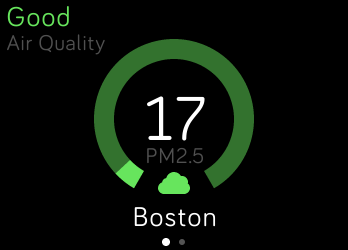
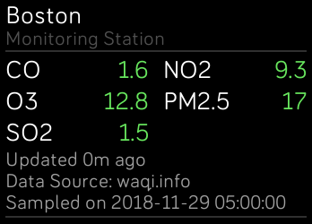

# Air Quality

See air quality reports from 10k monitoring stations around the world. Reports are in the form of calculated AQI (Air Quality Index) for major air pollutants. The higher the AQI value, the greater the level of air pollution and the greater the health concern. Air pollutant with the highest AQI is shown on the main screen for the selected monitoring station. Tap the screen to see complete AQI list. Scroll down to access historical data.

Features: 
- add up to 3 monitoring stations
- see data from the nearby station
- see distance to the nearby station
- air sampling time and date (station local time)
- use photo from your mobile device as background
- track historical data (max AQI values for the last 5 days)
- customize fetch schedule

Get the app here https://gam.fitbit.com/gallery/app/b66657c1-f6d2-4397-af8c-50992340e8b4

## Built With

Fitbit ([SDK](https://dev.fitbit.com/getting-started))

## Localization

Help translate Air Quality into your language: [POEditor Project](https://poeditor.com/join/project/OcBNqlpxR4)

## License

Licensed under the [MIT License](./LICENSE).
